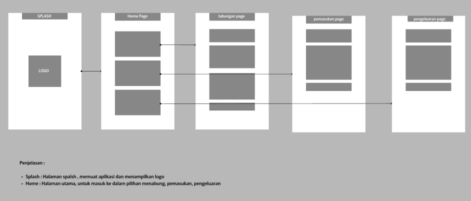
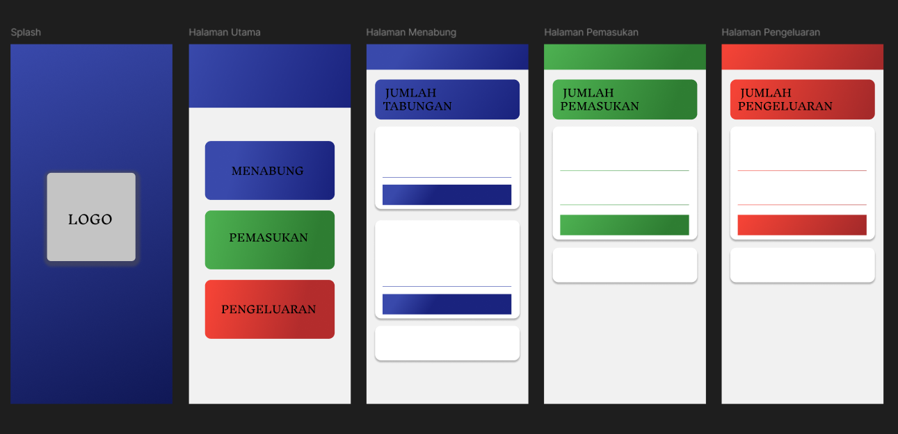

# UAS Pemogramanan Mobile

#  📖 Pembukuan

  
  

## 👤 Profil Mahasiswa

| Atribut            | Keterangan                    |
| ------------------ | ----------------------------- |
| **Nama**           | Faiz Maulana                  |
| **NIM**            | 312310469                     |
| **Kelas**          | TI.23.A.5                     |
| **Mata Kuliah**    | Pemrograman Mobile 1          |
| **Dosen Pengampu** | Donny Maulana S.kom., M.M.S.I |

---

##  📖 Selamat Datang di Aplikasi **Pembukuan**!

# Aplikasi Pembukuan

Selamat datang di project Aplikasi Pembukuan perangkat lunak yang dirancang untuk membantu individu atau bisnis dalam mencatat dan mengelola keuangan, termasuk pemasukan, pengeluaran, dan tabungan. Aplikasi ini sudah lengkap dengan fitur-fitur terbaik untuk pengalaman pengguna yang lebih terorganisir dan nyaman.

## Tujuan Aplikasi
1. **Pencatatan Keuangan yang Mudah:**
 Memungkinkan pengguna untuk mencatat pemasukan dan pengeluaran secara cepat dan praktis, sehingga memudahkan dalam memonitor kondisi keuangan sehari-hari.
2. **Pengelolaan Anggaran:**
 Aplikasi ini membantu pengguna merencanakan dan mengatur anggaran bulanan, sehingga dapat mengontrol pengeluaran dan menghindari pemborosan.
3. **Analisis Pengeluaran:**
 Dengan fitur laporan dan grafik, pengguna dapat menganalisis pola pengeluaran mereka, yang membantu dalam membuat keputusan finansial yang lebih bijak.
4. **Pencatatan Tabungan:**
 Memudahkan pengguna untuk mencatat dan memantau tabungan, serta menetapkan tujuan tabungan yang ingin dicapai. 

Dengan tujuan-tujuan ini, aplikasi pembukuan menjadi alat yang sangat berguna bagi individu dalam mencapai kestabilan dan kebebasan finansial.

---

## 📝 Storyboard

## 🎨 Mockup

## 💻 UI/UX Preview

---

# Aplikasi Pembukuan

## Status Proyek: Phase 1 
Pada tahap pertama ini, fokus kami adalah membangun fondasi utama Aplikasi Pembukuan. Kami mengembangkan fitur inti seperti tampilan Halaman Utama dari Pembukuan, dan navigasi ke halaman Menabung, navigasi ke halaman Pemasukan, navigasi ke halaman Pengeluaran. Desain pada tahap ini masih minimalis, dengan tujuan memastikan stabilitas dan fungsionalitas dasar aplikasi.

### Berikut pyoyek pada saat progres pengerjaan phase 1 :

***halaman utama*** aplikasi "pembukuan" yang berisi tiga tombol utama: Menabung, Pemasukan, dan Pengeluaran. Desainnya sederhana dengan latar belakang putih dan tombol berwarna lembut. Halaman ini diatur melalui MainActivity dalam proyek Android Studio.

## Catatan Pengembangan:

## Status Proyek: Phase 2 - Peningkatan Fitur dan Pengalaman Pengguna

Pada tahap kedua ini, kami fokus pada peningkatan fungsionalitas dan pengalaman pengguna Aplikasi Pembukuan. Kami telah menambahkan fitur-fitur baru dan menyempurnakan yang sudah ada untuk memberikan pengalaman yang lebih baik kepada pengguna.

## Apa yang Baru di Phase 2?

1. Implementasi fitur setiap item yang berfungsi penuh
2. Penambahan Splash Screen saat membuka aplikasi
3. Peningkatan fungsionalitas
4. Penyempurnaan antarmuka pengguna untuk navigasi yang lebih intuitif

## Launcher Icon

Ikon aplikasi utama yang muncul di layar beranda atau daftar aplikasi pada perangkat pengguna. Launcher Icon dirancang untuk mencerminkan identitas visual Pembukuan yang modern, sederhana, dan profesional. Dengan desain baru, ikon ini dibuat:

- Menggunakan format Jpg dengan resolusi tinggi untuk memastikan tampilannya tajam di semua perangkat.
- Menampilkan logo aplikasi dengan warna abu abu terang yang melambangkan pembukuan modern.
- Menggabungkan elemen visual seperti buku untuk mewakili konsep pembukuan yang efektif.
- Dirancang dengan gaya minimalis namun mudah dikenali, memberikan kesan pertama yang positif tentang aplikasi Pembukuan.
- Menggunakan kombinasi warna biru gelap, biru terang dan abu abu untuk menciptakan kontras yang menarik perhatian sekaligus menyampaikan pesan Pembukuan yang modern.

Launcher Icon ini bertujuan untuk segera mengkomunikasikan tujuan aplikasi Pembukuan kepada pengguna, menarik perhatian mereka di antara berbagai aplikasi lain di perangkat mereka.

## Fitur Utama Aplikasi:

### 1. Splash Screen

### 2. Halaman Utama Pembukuan

### 2. Halaman Menabung

### 2. Halaman Pemasukan

### 2. Halaman Pengeluaran

## Peningkatan Teknis:

- Optimalisasi performa aplikasi untuk loading yang lebih cepat
- Perbaikan bug dan peningkatan stabilitas
- Peningkatan responsivitas UI untuk berbagai ukuran layar

## Teknologi yang Digunakan:

- Frontend: Android (Java)
- Desain: Material Design

## Cara Menggunakan Aplikasi
1. **Instal Aplikasi:**
- Pastikan aplikasi telah diinstal di perangkat Android Anda melalui file APK.
2. **Buka Aplikasi:**
- Temukan ikon aplikasi di layar utama atau dalam daftar aplikasi Anda, lalu ketuk untuk membukanya.
3. **Navigasi ke Fitur Utama:**
- Setelah aplikasi terbuka, Anda akan melihat beberapa pilihan seperti Pemasukan, Pengeluaran, dan Menabung. Pilih salah satu dengan mengetuk opsi tersebut.
4. **Menambahkan Pemasukan/Pengeluaran/Tabungan:**
- Ketika berada di halaman yang sesuai (misalnya, Pemasukan), masukkan jumlah uang pada kolom yang disediakan.
- Tambahkan keterangan jika diperlukan.
- Tekan tombol Tambah Pemasukan (atau tombol yang sesuai untuk fitur lain) untuk menyimpan data.
5. **Melihat Riwayat:**
- Di setiap halaman (Pemasukan, Pengeluaran, Menabung), terdapat bagian untuk melihat riwayat transaksi yang telah Anda catat. Ini biasanya ditampilkan di bawah form input.
6. **Kembali ke Halaman Sebelumnya:**
- Gunakan tombol kembali (ikon panah) untuk kembali ke menu utama atau halaman sebelumnya kapan saja.
7. **Keluar dari Aplikasi:**
- Untuk menutup aplikasi, cukup tekan tombol home di perangkat Anda atau gunakan tombol kembali hingga keluar dari aplikasi.
